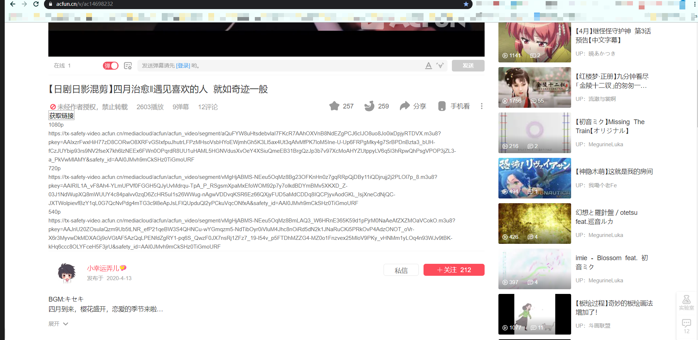

# A 站视频缓存 | reddit 视频缓存

谁不想在遇到好视频的时候能够缓存下来呢？

**声明：** 本教程提供一种缓存视频的方法，意在方便离线也能观看，对于任何不当使用概不负责！

## TODO

- [ ] 旧方法完成批量转换地址脚本
- [ ] chrome 插件化
- [x] 脚本化
- [ ] 网站化（大概不必要）

## 更新

- 20190903:添加一种方法
- 20200201:添加新方法，升级旧方法
- 20200211:修复番剧无法提取的问题
- 20200212:新增 reddit 视频提取
- 20200415：新增油猴脚本

## A 站

### 脚本提取

安装脚本->[A 站视频缓存 视频链接解析](https://greasyfork.org/zh-CN/scripts/400867-a-%E7%AB%99%E8%A7%86%E9%A2%91%E7%BC%93%E5%AD%98-%E8%A7%86%E9%A2%91%E9%93%BE%E6%8E%A5%E8%A7%A3%E6%9E%90)

该脚本会添加一个获取链接的按钮，解析的结果会显示在网页上。

测试地址：[【日剧日影混剪】四月治愈‖遇见喜欢的人 就如奇迹一般](https://www.acfun.cn/v/ac14698232)



### 手动提取

通过手动提取`m3u8`地址，然后直接使用下载器下载整合。原理并没有太大区别，很适合临时使用。

- 1 手动提取`m3u8`地址

用`F12`打开控制台，输入以下代码：

A 站

```js
var acdata = JSON.parse(window.pageInfo.currentVideoInfo.ksPlayJson)
  .adaptationSet.representation;
console.log(
  "Please copy m3u8 url below(max screen resolution):\n复制以下m3u8链接（最高清晰度）:\n",
  acdata.pop().url
);
```

reddit

```js
var redditdata = document.getElementsByTagName("source");
console.log(
  "Please copy m3u8 url below(additional audio):\n复制以下m3u8链接（外挂音频）:\n",
  redditdata[redditdata.length - 1].src
);
```

- 2 使用下载器下载整合

下载[m3u8 downloader](https://github.com/nilaoda/N_m3u8DL-CLI/releases)，分别下载一个主程序和一个 dll 库文件。再下载[ffmpeg](https://ffmpeg.zeranoe.com/builds/win64/static/)，选最下面最新的进行解压，并把前面下载的两个文件拷贝到`bin`目录，双击运行 m3u8 downloader 主程序，输入第一步拷贝的链接粘贴即可下载，输出`.mp4`文件在当前目录的`Download`文件夹。Reddit 是外挂音频，所以会有单独下载的音频文件，需要自己再合成一下。

## 演示

- 普通视频


- 番剧


- 缓存中


- reddit


## 旧方法（不推荐）

A 站原先用硕鼠直接可以下载，现在只能下 m3u8 文件，需要再用对应下载器下载整合。而且是相对地址需要前缀,步骤如下

- 1 使用硕鼠下载`.m3u8`文件

把 a 站视频网址输入到硕鼠官网，解析后下载`.m3u8`文件，放入`source`源文件夹。

- 2 脚本批量添加前缀

首先用 network 查看一般的 xhr 视频片段请求的地址，取其前缀类似于

```sh
https://tx-video.acfun.cn/mediacloud/acfun/acfun_video/segment/
```

复制到`main.ts`，然后编译运行

**环境要求：** _nodejs,typescript_

```sh
tsc
node ./dist/main.js
```

程序会把`.m3u8`文件每个地址都加上这个前缀。结果输出在`target`目标文件夹。

- 3 下载并整合

把修改后的文件拖入`m3u8下载器`(网上搜索)即可下载。输出文件在程序目录下的`output`文件夹里。最后用`FFpegm`整合成一个视频文件。

## References

1. [m3u8 downloader](https://github.com/nilaoda/N_m3u8DL-CLI/releases)
2. [ffmpeg](https://ffmpeg.zeranoe.com/builds/win64/static/)
3. [Acfun-hls](https://greasyfork.org/zh-CN/scripts/389607-acfun-hls)
